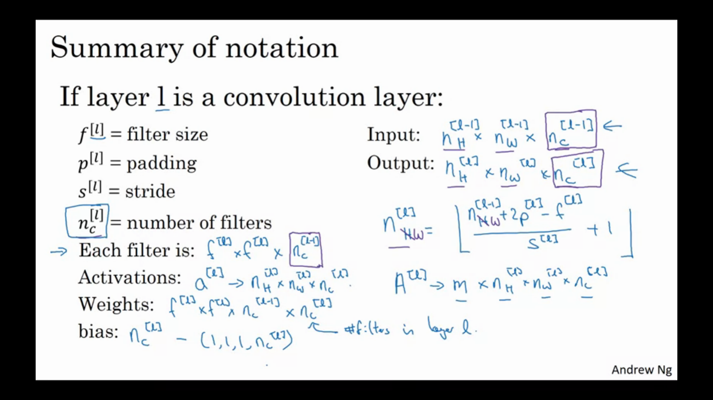
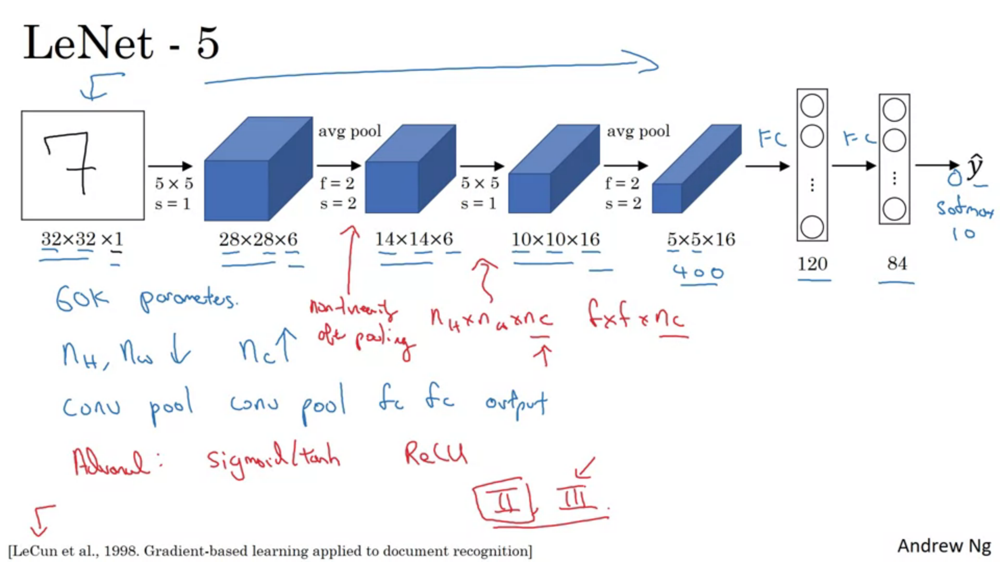
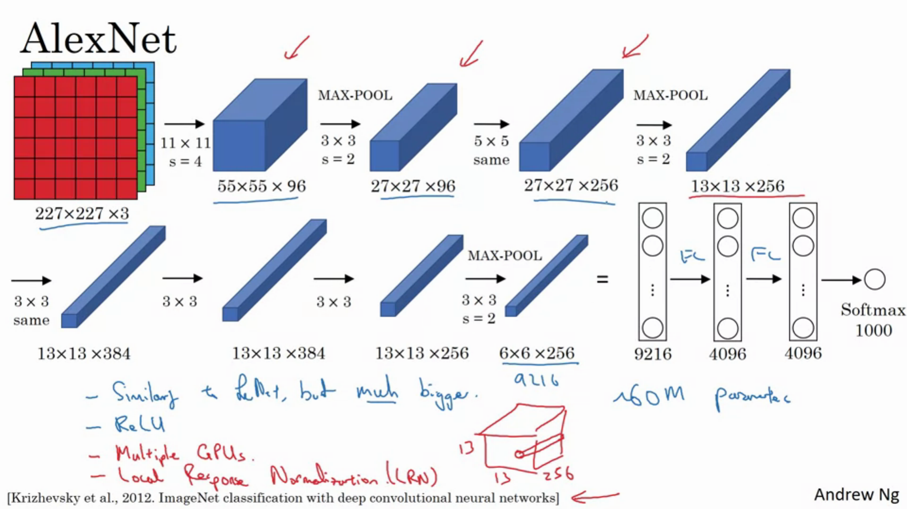
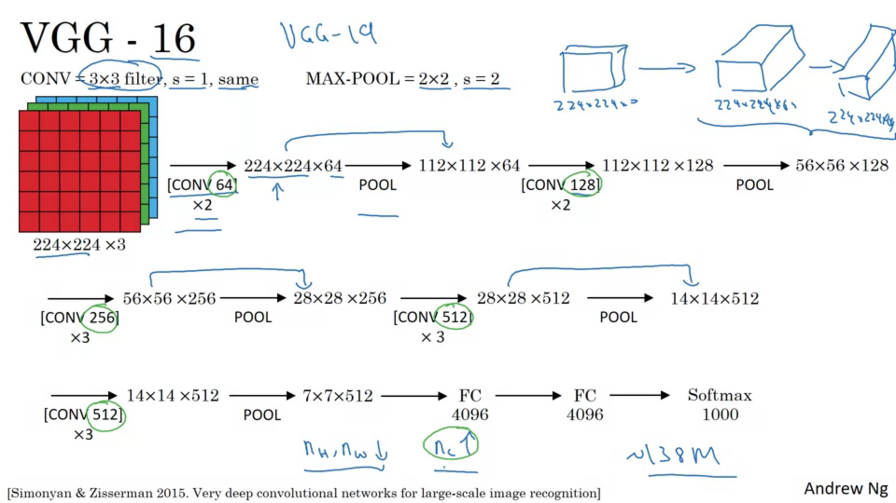

# ConvNets !!

## Basic fields in Computer Vision:
* Object Detection
* Image Classification
* Neural Style transfer

## Need of Convolutional Neural Networks:
* Since we need to work on larger images as well, the number of neurons and the weights is really very large in number. This would require a large amount of memory and wont be efficient.

## Edge detection:
[1,0,-1  
 1,0,-1  
 1,0,-1]  
This filter can be used for vertical edge detection.  
For horizontal,  
 [1,1,1  
  0,0,0  
  -1,-1,-1]  

   
Some important filters:  
* Sobel:  
[1,0,-1  
 2,0,-2  
 1,0,-1]  

* Scharr Filter:  
[3,0,-3  
 10,0,-10  
 3,0,-3]   

**The filters can also be learnt through NNs to apply edge detection.**

## Convolutions
### Padding
* nxn image and fxf filter will give an n-f+1 x n-f+1 image.
* Two problems:  
1. Image shrinks
2. Information from the corner of images is wasted.  
  
To fix both of these problems we can **pad** the images by an additional layer of zeros around the corners.  
* Two types of padding:  
1. Valid convolutions: No padding
2. Same convolutions: p = (f-1)/2

* f is generally an odd number.

### Stride
* Previously we were taking stride 1.
* For stride s and padding p, output is floor((n+2p-f)/s + 1)
* In mathematics convolution operation involves first flipping the filter horizontally and vertically before "cross correlating". The actual convolve operation that we do here is actually mathematically called cross-correlation. This is done (in maths) so that associativity is true.

### Convolution over volume
* Image is suppose 7x7x**3** then, the filter is 3x3x**3**
* One filter gives one output layer. Hence number of filters will determine the number of channels of the output layer.
* nxnxnc * (fxfxnc) x nc' =  floor((n+2p-f)/s + 1) x floor((n+2p-f)/s + 1) x nc'  
 
 

## Convolutional neural networks

**Pay attention to the notation of A[l]**  
**Note that the number of learnable parameters in a conv operation is independent of the input image size**

### Parts of a ConvNet:
* Convolution (CONV)
* Pooling (POOL)
* Fully Connected (FC)

#### Pooling:
* Only hyperparameters f and s
* Two types: Max pool and average pool
* Padding is very rarely done
* No parameters to learn
For multi channel, pooling is applied individually to each channel.

#### FC layer:
* Take the image matrix and convert it into a long column vector and apply normal matrix multiplication with weights and add biases.
------

* Typical ConvNet consists of  
CONV(1 or 2), POOL, CONV(1 or 2), POOL, FC, FC, FC, Softmax.

## Why look at case Studies?:
* Similar to the fact that when we get an implementation of a code we try to look at the code and understand the implementation, similarly for ConvNets, the typical architecture and the popular implementations of CNNs tend to work in various domains. Hence it is useful to look at such implementations.

## Some popular ConvNet architectures:
* [LeNet-5](https://www.google.com/url?sa=t&rct=j&q=&esrc=s&source=web&cd=&ved=2ahUKEwjPuoHpncXqAhUFeysKHRpyDmsQFjABegQIAxAB&url=http%3A%2F%2Fvision.stanford.edu%2Fcs598_spring07%2Fpapers%2FLecun98.pdf&usg=AOvVaw1r5QRjS6yPaYsenIJ6-SLm)

* [Alex Net](https://www.google.com/url?sa=t&rct=j&q=&esrc=s&source=web&cd=&ved=2ahUKEwiqgbLMgcXqAhVHfX0KHeKwDyoQFjAAegQIBRAB&url=https%3A%2F%2Fpapers.nips.cc%2Fpaper%2F4824-imagenet-classification-with-deep-convolutional-neural-networks.pdf&usg=AOvVaw2hqjjvSjIpuuCLLdojAmS5)

* [VGG-16](https://arxiv.org/pdf/1409.1556.pdf%20http://arxiv.org/abs/1409.1556)

