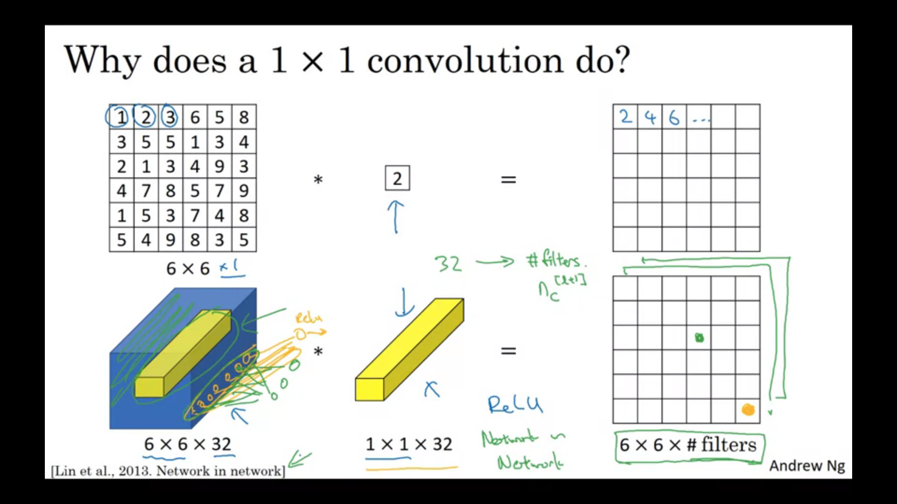

# ConvNets !!

## Basic fields in Computer Vision:
* Object Detection
* Image Classification
* Neural Style transfer

## Need of Convolutional Neural Networks:
* Since we need to work on larger images as well, the number of neurons and the weights is really very large in number. This would require a large amount of memory and wont be efficient.

## Edge detection:
[1,0,-1  
 1,0,-1  
 1,0,-1]  
This filter can be used for vertical edge detection.  
For horizontal,  
 [1,1,1  
  0,0,0  
  -1,-1,-1]  

   
Some important filters:  
* Sobel:  
[1,0,-1  
 2,0,-2  
 1,0,-1]  

* Scharr Filter:  
[3,0,-3  
 10,0,-10  
 3,0,-3]   

**The filters can also be learnt through NNs to apply edge detection.**

## Convolutions
### Padding
* nxn image and fxf filter will give an n-f+1 x n-f+1 image.
* Two problems:  
1. Image shrinks
2. Information from the corner of images is wasted.  
  
To fix both of these problems we can **pad** the images by an additional layer of zeros around the corners.  
* Two types of padding:  
1. Valid convolutions: No padding
2. Same convolutions: p = (f-1)/2

* f is generally an odd number.

### Stride
* Previously we were taking stride 1.
* For stride s and padding p, output is floor((n+2p-f)/s + 1)
* In mathematics convolution operation involves first flipping the filter horizontally and vertically before "cross correlating". The actual convolve operation that we do here is actually mathematically called cross-correlation. This is done (in maths) so that associativity is true.

### Convolution over volume
* Image is suppose 7x7x**3** then, the filter is 3x3x**3**
* One filter gives one output layer. Hence number of filters will determine the number of channels of the output layer.
* nxnxnc * (fxfxnc) x nc' =  floor((n+2p-f)/s + 1) x floor((n+2p-f)/s + 1) x nc'  
 
 

## Convolutional neural networks

**Pay attention to the notation of A[l]**  
**Note that the number of learnable parameters in a conv operation is independent of the input image size**

### Parts of a ConvNet:
* Convolution (CONV)
* Pooling (POOL)
* Fully Connected (FC)

#### Pooling:
* Only hyperparameters f and s
* Two types: Max pool and average pool
* Padding is very rarely done
* No parameters to learn
For multi channel, pooling is applied individually to each channel.

#### FC layer:
* Take the image matrix and convert it into a long column vector and apply normal matrix multiplication with weights and add biases.
------

* Typical ConvNet consists of  
CONV(1 or 2), POOL, CONV(1 or 2), POOL, FC, FC, FC, Softmax.

## Why look at case Studies?:
* Similar to the fact that when we get an implementation of a code we try to look at the code and understand the implementation, similarly for ConvNets, the typical architecture and the popular implementations of CNNs tend to work in various domains. Hence it is useful to look at such implementations.

## Some popular ConvNet architectures:
* [LeNet-5](https://www.google.com/url?sa=t&rct=j&q=&esrc=s&source=web&cd=&ved=2ahUKEwjPuoHpncXqAhUFeysKHRpyDmsQFjABegQIAxAB&url=http%3A%2F%2Fvision.stanford.edu%2Fcs598_spring07%2Fpapers%2FLecun98.pdf&usg=AOvVaw1r5QRjS6yPaYsenIJ6-SLm)

* [Alex Net](https://www.google.com/url?sa=t&rct=j&q=&esrc=s&source=web&cd=&ved=2ahUKEwiqgbLMgcXqAhVHfX0KHeKwDyoQFjAAegQIBRAB&url=https%3A%2F%2Fpapers.nips.cc%2Fpaper%2F4824-imagenet-classification-with-deep-convolutional-neural-networks.pdf&usg=AOvVaw2hqjjvSjIpuuCLLdojAmS5)

* [VGG-16](https://arxiv.org/pdf/1409.1556.pdf%20http://arxiv.org/abs/1409.1556)

* [Resnet](https://www.google.com/url?sa=t&rct=j&q=&esrc=s&source=web&cd=&cad=rja&uact=8&ved=2ahUKEwjw9Z6i4cbqAhWDF3IKHY01Bz0QFjABegQIAhAB&url=https%3A%2F%2Farxiv.org%2Fpdf%2F1512.03385&usg=AOvVaw3vV99r-Ks0UEPt0ndF0YoP)

<ul>
	<li>When training deep networks due to the problem of vanishing/exploding gradients, training becomes more and more difficult.</li>
	<li>To overcome this problem, Resnets were designed. Resnets stand for 'Residual Networks'. </li>
	<li>Residual block is as described in the slide below.r</li>
	<li>ResNets have a better graph of training error vs no.of layers as compared to the "plain" networks. </li>
</ul>

## Why do Resnets work better?
* Due to the g(W[l+2]a[l+1] + b[l+2] + a[l]). If we use L2 regularization, W tends to decay(weight decay). Let's assume that the weight and bias are 0. Hence ReLU of a[l] = a[l]. Hence this is like an identity function. The hidden units may learn something useful or just learn the identity function to not hurt the performance. 
* The problem with the plain NNs is that it is actually quite difficult to learn the identity function as compared to the ease due to the skip connections.
* <b>Note that in the residual block, the layer which is undergoing skip connection should have the same dimensiona as the layer which it is being added to. If the dimensions are different, then either we can have a matrix Ws multiplied by a[l] to correct the dimensions or by zero-padding a[l] to match the dimensions.</b>

## 1x1 Convolutions:  
[Network in Network](https://arxiv.org/pdf/1312.4400.pdf%20http://arxiv.org/abs/1312.4400)

* In 2D 1x1 convolution does not make much sense because it is just like multiplying by a constant number.
* In 3D is found to be quite useful tool to add a bit of non linearity to the model, In the figure shown below, **after convolving the filter  a ReLU activation is applied**. It is similar to a fully connected layer. It is like multiplying a 32 dimensional vector with a 32 dimensional row vector and applying ReLU to get the output. The number of rows of the weights is the number of filters.
* Also called network in network. 

### Using 1x1 convolutions:
* We can use it to shrink the number of channels.
* Adds non-linearity
* Useful for building the 'inception network'.

## Inception Network Motivation
* [Inception Networks](https://www.google.com/url?sa=t&rct=j&q=&esrc=s&source=web&cd=&ved=2ahUKEwjm6oXCi8fqAhUCeisKHf4UAtgQFjACegQIBhAB&url=https%3A%2F%2Farxiv.org%2Fpdf%2F1409.4842&usg=AOvVaw3v1ON5KCX99lZhuMLtNROq)

* For convnets, instead of deciding whether to use a 3x3 filter or 5x5 filter or a pooling layer, just use all of them and concatenate all of them into one final layer.
* <b>Note here each of the operation must give a same height and width which also means that for pooling operation we have to use padding also which is quite weird.</b>
* The problem that arises due to the above method is that it becomes computationally more expensive.
* To overcome this we use the '**bottleneck operation**' where we convert the initial matrix into a smaller one. For example convert the 28x28x192 to a 28x28x16 using a 1x1 conv.
* Then operate on the various options and concatenate the results. This reduces the number of multiplication by 10 folds.

## Implementing 
* In order to implement the code, downloading open source codes and the weights form GitHub is considered as the best practice and then implement transfer learning.

* For implementing transfer learning, one may change the weights of the last layer, a last few layers or the entire weights 

### Data Augmentatiom:
* Mirroring
* Random Cropping - isn't a perfect method but works well
* Rotation*
* Shearing*
* Local Warping*
* Color Shifting  
* PCA color augmentation : used in AlexNet paper.

## To achieve benchmarks and do well in computer vision competitions
* Ensembling : To average out the outputs from several trained neural networks
* Multi crop at test time

## Small note on how to read research papers:
* Do <u>NOT</u> read from the first word till the last word.
* Take multiple passes.
1. Title/Abstract/figures
2. Introduction + Conclusion + Figures + skim rest (skip related works)
3. Read but skip/skim the math
4. Whole thing but skip parts that don't make sense
5. Now try and understand the parts which didn't make sense.

### Questions to keep in mind while reading a paper:
* What did the authors try to accomplish?
* What were the key elements of the approach?
* What can you use yourself?
* What other reference do you want to follow?
