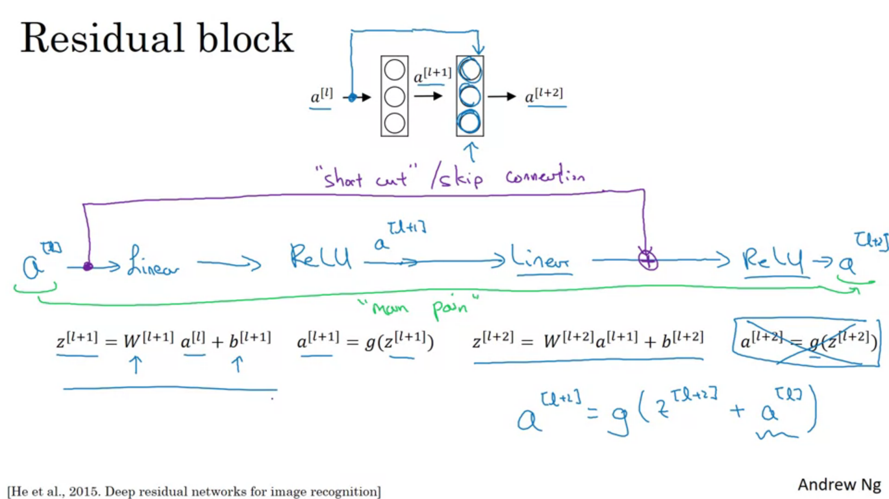
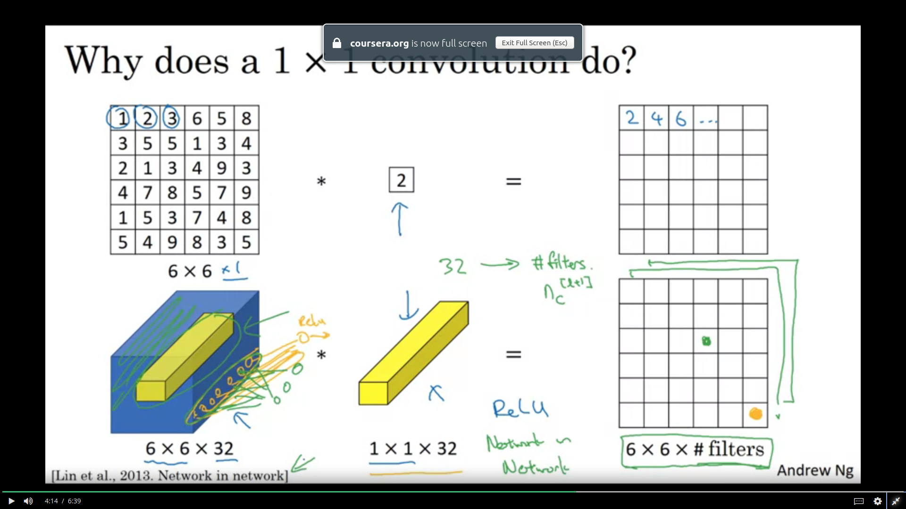
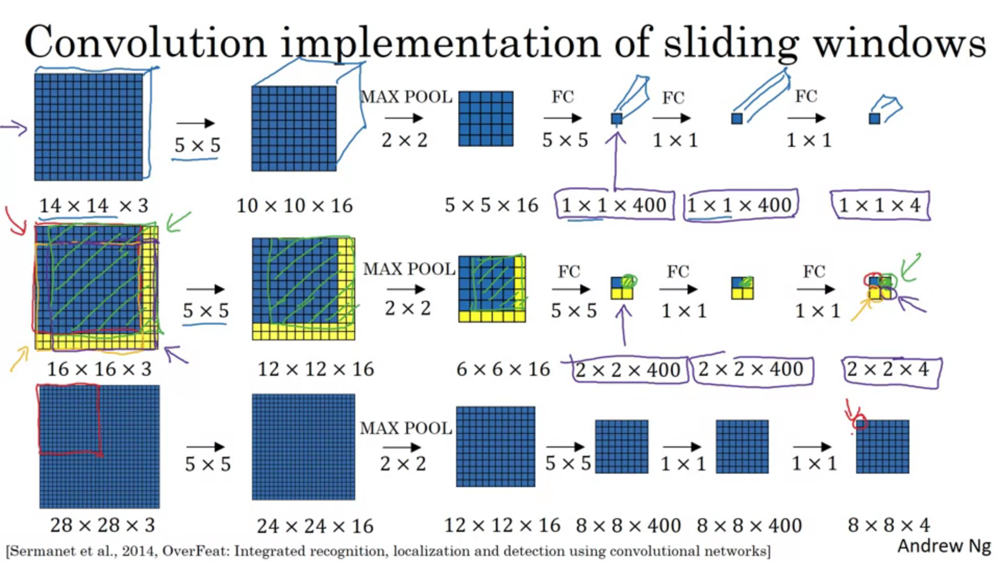

# ConvNets !!

## Basic fields in Computer Vision:
* Object Detection
* Image Classification
* Neural Style transfer

## Need of Convolutional Neural Networks:
* Since we need to work on larger images as well, the number of neurons and the weights is really very large in number. This would require a large amount of memory and wont be efficient.

## Edge detection:
[1,0,-1  
 1,0,-1  
 1,0,-1]  
This filter can be used for vertical edge detection.  
For horizontal,  
 [1,1,1  
  0,0,0  
  -1,-1,-1]  

   
Some important filters:  
* Sobel:  
[1,0,-1  
 2,0,-2  
 1,0,-1]  

* Scharr Filter:  
[3,0,-3  
 10,0,-10  
 3,0,-3]   

**The filters can also be learnt through NNs to apply edge detection.**

## Convolutions
### Padding
* nxn image and fxf filter will give an n-f+1 x n-f+1 image.
* Two problems:  
1. Image shrinks
2. Information from the corner of images is wasted.  
  
To fix both of these problems we can **pad** the images by an additional layer of zeros around the corners.  
* Two types of padding:  
1. Valid convolutions: No padding
2. Same convolutions: p = (f-1)/2

* f is generally an odd number.

### Stride
* Previously we were taking stride 1.
* For stride s and padding p, output is floor((n+2p-f)/s + 1)
* In mathematics convolution operation involves first flipping the filter horizontally and vertically before "cross correlating". The actual convolve operation that we do here is actually mathematically called cross-correlation. This is done (in maths) so that associativity is true.

### Convolution over volume
* Image is suppose 7x7x**3** then, the filter is 3x3x**3**
* One filter gives one output layer. Hence number of filters will determine the number of channels of the output layer.
* nxnxnc * (fxfxnc) x nc' =  floor((n+2p-f)/s + 1) x floor((n+2p-f)/s + 1) x nc'  
 
 

## Convolutional neural networks

**Pay attention to the notation of A[l]**  
**Note that the number of learnable parameters in a conv operation is independent of the input image size**

### Parts of a ConvNet:
* Convolution (CONV)
* Pooling (POOL)
* Fully Connected (FC)

#### Pooling:
* Only hyperparameters f and s
* Two types: Max pool and average pool
* Padding is very rarely done
* No parameters to learn
For multi channel, pooling is applied individually to each channel.

#### FC layer:
* Take the image matrix and convert it into a long column vector and apply normal matrix multiplication with weights and add biases.
------

* Typical ConvNet consists of  
CONV(1 or 2), POOL, CONV(1 or 2), POOL, FC, FC, FC, Softmax.

## Why look at case Studies?:
* Similar to the fact that when we get an implementation of a code we try to look at the code and understand the implementation, similarly for ConvNets, the typical architecture and the popular implementations of CNNs tend to work in various domains. Hence it is useful to look at such implementations.

## Some popular ConvNet architectures:
* [LeNet-5](https://www.google.com/url?sa=t&rct=j&q=&esrc=s&source=web&cd=&ved=2ahUKEwjPuoHpncXqAhUFeysKHRpyDmsQFjABegQIAxAB&url=http%3A%2F%2Fvision.stanford.edu%2Fcs598_spring07%2Fpapers%2FLecun98.pdf&usg=AOvVaw1r5QRjS6yPaYsenIJ6-SLm)

* [Alex Net](https://www.google.com/url?sa=t&rct=j&q=&esrc=s&source=web&cd=&ved=2ahUKEwiqgbLMgcXqAhVHfX0KHeKwDyoQFjAAegQIBRAB&url=https%3A%2F%2Fpapers.nips.cc%2Fpaper%2F4824-imagenet-classification-with-deep-convolutional-neural-networks.pdf&usg=AOvVaw2hqjjvSjIpuuCLLdojAmS5)

* [VGG-16](https://arxiv.org/pdf/1409.1556.pdf%20http://arxiv.org/abs/1409.1556)

* [Resnet](https://www.google.com/url?sa=t&rct=j&q=&esrc=s&source=web&cd=&cad=rja&uact=8&ved=2ahUKEwjw9Z6i4cbqAhWDF3IKHY01Bz0QFjABegQIAhAB&url=https%3A%2F%2Farxiv.org%2Fpdf%2F1512.03385&usg=AOvVaw3vV99r-Ks0UEPt0ndF0YoP)

<ul>
	<li>When training deep networks due to the problem of vanishing/exploding gradients, training becomes more and more difficult.</li>
	<li>To overcome this problem, Resnets were designed. Resnets stand for 'Residual Networks'. </li>
	<li>Residual block is as described in the slide below.r</li>
	<li>ResNets have a better graph of training error vs no.of layers as compared to the "plain" networks. </li>
</ul>

## Why do Resnets work better?
* Due to the g(W[l+2]a[l+1] + b[l+2] + a[l]). If we use L2 regularization, W tends to decay(weight decay). Let's assume that the weight and bias are 0. Hence ReLU of a[l] = a[l]. Hence this is like an identity function. The hidden units may learn something useful or just learn the identity function to not hurt the performance. 
* The problem with the plain NNs is that it is actually quite difficult to learn the identity function as compared to the ease due to the skip connections.
* <b>Note that in the residual block, the layer which is undergoing skip connection should have the same dimensiona as the layer which it is being added to. If the dimensions are different, then either we can have a matrix Ws multiplied by a[l] to correct the dimensions or by zero-padding a[l] to match the dimensions.</b>

## 1x1 Convolutions:  
[Network in Network](https://arxiv.org/pdf/1312.4400.pdf%20http://arxiv.org/abs/1312.4400)

* In 2D 1x1 convolution does not make much sense because it is just like multiplying by a constant number.
* In 3D is found to be quite useful tool to add a bit of non linearity to the model, In the figure shown below, **after convolving the filter  a ReLU activation is applied**. It is similar to a fully connected layer. It is like multiplying a 32 dimensional vector with a 32 dimensional row vector and applying ReLU to get the output. The number of rows of the weights is the number of filters.
* Also called network in network. 

### Using 1x1 convolutions:
* We can use it to shrink the number of channels.
* Adds non-linearity
* Useful for building the 'inception network'.

## Inception Network Motivation
* [Inception Networks](https://www.google.com/url?sa=t&rct=j&q=&esrc=s&source=web&cd=&ved=2ahUKEwjm6oXCi8fqAhUCeisKHf4UAtgQFjACegQIBhAB&url=https%3A%2F%2Farxiv.org%2Fpdf%2F1409.4842&usg=AOvVaw3v1ON5KCX99lZhuMLtNROq)

* For convnets, instead of deciding whether to use a 3x3 filter or 5x5 filter or a pooling layer, just use all of them and concatenate all of them into one final layer.
* <b>Note here each of the operation must give a same height and width which also means that for pooling operation we have to use padding also which is quite weird.</b>
* The problem that arises due to the above method is that it becomes computationally more expensive.
* To overcome this we use the '**bottleneck operation**' where we convert the initial matrix into a smaller one. For example convert the 28x28x192 to a 28x28x16 using a 1x1 conv.
* Then operate on the various options and concatenate the results. This reduces the number of multiplication by 10 folds.

## Implementing 
* In order to implement the code, downloading open source codes and the weights form GitHub is considered as the best practice and then implement transfer learning.

* For implementing transfer learning, one may change the weights of the last layer, a last few layers or the entire weights 

### Data Augmentatiom:
* Mirroring
* Random Cropping - isn't a perfect method but works well
* Rotation*
* Shearing*
* Local Warping*
* Color Shifting  
* PCA color augmentation : used in AlexNet paper.

## To achieve benchmarks and do well in computer vision competitions
* Ensembling : To average out the outputs from several trained neural networks
* Multi crop at test time

## Small note on how to read research papers:
* Do <u>NOT</u> read from the first word till the last word.
* Take multiple passes.
1. Title/Abstract/figures
2. Introduction + Conclusion + Figures + skim rest (skip related works)
3. Read but skip/skim the math
4. Whole thing but skip parts that don't make sense
5. Now try and understand the parts which didn't make sense.

### Questions to keep in mind while reading a paper:
* What did the authors try to accomplish?
* What were the key elements of the approach?
* What can you use yourself?
* What other reference do you want to follow?

## Object detection with Localization:
* To detect a bounding box as well as classify the image. 
* Represeantation of bounding box: (bx, by, bw, bh)  
(bx,by) : coordinates of the center of the bounding box  
bh, bw : Height and width of the bounding box

### Defining the target label y:
* y = [pc bx by bh bw c1 c2 ..... cn].T 
* pc : is the probability that there is an object in the image. **If the value of pc is 0 then the other parameters of y are "Don't Cares"**
* c1....cn are the output of softmax classifier for n classes.
* Cost function:  
1. We can have a mean squared error for the all the components of y.
2. Another better alternative is to keep only the bounding box parameters to have mean squared error while the pc term could have a logistic loss function and the ci terms could have a log likelihood loss for the softmax terms.

## Landmark Detection:
* If we have to detect certain landmarks from the face of a person then, what we can do is keep the first value of the output vector as probability whether the person is there or not and then have two output units for the x and y coordinates for each of the landmarks to be detected. 

## Object Detection:
* First train a conv net to classify whether or not there is the object of interest like a car say.

### Sliding windows method
* Now take a small window and move it along the image and then for each position of the image, check whether or not a car is present.

<b>Downside of this method is the computational cost...</b>

### Convolutional Implementation of Sliding Windows
[Sermanet et al 2014](https://www.google.com/url?sa=t&rct=j&q=&esrc=s&source=web&cd=&ved=2ahUKEwjvgoe31OfqAhVSjeYKHci9AggQFjABegQIBRAB&url=https%3A%2F%2Farxiv.org%2Fpdf%2F1312.6229&usg=AOvVaw2GJRe3zN8ediGY43EnwTTL)
* Converting FC layer to a convolutional operation: Take the filter size same as the image size and keep the number of filters same as the number of output layers required.
* Instead of using providing only parts of the window into the conv net which classifies, what we can do is keep the whole image as the input image. This helps in sharing the computation.

* One problem is that it doesn't accurately give the bounding box.

## YOLO algorithm:
[YOLO Paper: Redmon et al 2015](https://arxiv.org/pdf/1506.02640)
* Divide the image into 3x3 grid for example... (In practice Andrew uses 19x19 grid)
* Define the target label for each grid similar to the object detection with localization method.
* The object is associated to that grid cell where its midpoint lies.
* In the end the CNN outputs a 3x3x8 output here(3x3 for the grids and 8 is the number of elements in the final vector. In short there is an output vector for each grid)
* bx,by represent the coodrinates of the bounding box wrt the origin which is the top left corner of the grid to which the object belongs to and assuming that the lower right corner is (1,1)
* bh,bw are the ratios wrt the lengths of the grid size. 
* bx,by hence are in the range (0,1)
* bh,bw can be greater than 1 if the bounding box is greater than the grid size. But these values are surely greater than 0.

### Intersection over Union (IoU):
* To judge how well our predicted bounding box is compared to the perfect bounding box, calculate the following quantity:  
`IoU = area(intersection)/area(union)`
* IoU greater than 0.5 is considered good.

### Non-max suppression:
* In many cases, there may be more than one grid which may associate itself to an object and thus propose a bounding box each. Hence there may be more than one bounding boxes for a single object.
* To overcome this we do non max suppression:
1. Remove all the boxes having p<=0.6
2. Select the bounding box for an object which has the maximum value of p.
3. Remove all the boxes having an IoU of more than 0.5 with this box.
4. For multiple classes, run non max suppression for each class separately.

### Anchor Boxes:
* If the midpoint of two objects lie in the same grid, how do we detect both the boxes? This issue is solved using anchor boxes.
* Predefine anchor box shapes
* For example two anchor boxes may be a tall skinny one and a fat-wide one. 
* Now since there are two anchor boxes (in this example) the final vector y has to be repeated one more time so that each pair of 8 components (8 here is in the example continuing from above) can be associated to a (grid,anchor box).
* Each object is assigned to the grid cell with its midpt and to the anchor box with the highest IoU with the object's shape.

## Face Recognition:
* Face verification and Face recognition are two different things. Face verification means to verify whether or not the face belongs to the person who claims his identity. Face recognition involves going through a database of a lot of people and then find the match.

### One Shot Learning:
* Since DL algorithms cannot work well with just one training image of eaach person, it is not advisable to train a CNN for face recognition and then finally have a softmax classifier to classify who's image is it among the people in the database. One more disadvantage is that we would have to retrain the whole CNN if a member joins or leaves the organization.
* So to overcome this, we define a **similarity function** which could tell the degree of how similar two images are.
* `d(image1, image2) < T` where T is a hyperparameter.

## Siamese Network:
[Taigman et al., 2014 DeepFace](https://www.google.com/url?sa=t&rct=j&q=&esrc=s&source=web&cd=&cad=rja&uact=8&ved=2ahUKEwiR7e7Ap-_qAhUzzzgGHWVGAtkQFjABegQIBRAB&url=https%3A%2F%2Fwww.cs.toronto.edu%2F~ranzato%2Fpublications%2Ftaigman_cvpr14.pdf&usg=AOvVaw0JGaJnxb26d5u_F23NrdLo&cshid=1595917391522355)

* This basically encodes a person's image into say a 128 dimensional vector. That is, after going through many convolutional layers and fully connected layers, finally encoding a person's image into a 128 dimensional vector. 
* So, there exists a 128 dimensional vector corresponding to a particular person in the database.
* Now to find the similarity d, just find the **L2 norm** of the encodings of the persons.
* If the distance is less then they are similar and vice versa.

### Triplet Loss Function to train the Siamese Network
[Schroff et al., 2015, FaceNet](https://arxiv.org/pdf/1503.03832
A: Anchor  
P: Positive  
N: Negative  

|| f(A) - f(P) ||^2  - || f(A) - f(N) ||^2 <= 0  
The problem with this eqn is that the network may learn to keep f(x) = 0 or make f(x) a constant function so that this inequality is satisfied. To get over this problem we can introduce a margin term **epsilon** as well. Hence the eqn becomes:  
`|| f(A) - f(P) ||^2  - || f(A) - f(N) ||^2 + epsilon <= 0`  
where epsilon again is a hyperparameter.

**Triplet loss function**:  

` np.maximum(|| f(A) - f(P) ||^2  - || f(A) - f(N) ||^2 + epsilon , 0)`
This is the triplet loss function. The overall cost function is the sum over all the triplets.
If training set contains 10k examples of 1k person, we need to have ultiple pictures of a person to get the A,P pairs.

**How to choose the (A,P,N) pairs**:  
* One of the problems of random choosing is that getting the above constraint is quite simple so the algorithm doesn't need to do much to learn.
* So to construct  the trianing set we have to make the triplets hard to train on. So d(A,P) is quite close to d(A,N).
* The effect of choosing these triplets is that it increases the computational efficiency of the algorithm. Details are presented in the above paper of FaceNet.

### Face verification and Binary classification:
[Taigman et al., 2014](https://www.google.com/url?sa=t&rct=j&q=&esrc=s&source=web&cd=&cad=rja&uact=8&ved=2ahUKEwiK_7nR0u_qAhV5wjgGHQ-9DooQFjABegQIAxAB&url=https%3A%2F%2Fwww.cs.toronto.edu%2F~ranzato%2Fpublications%2Ftaigman_cvpr14.pdf&usg=AOvVaw0JGaJnxb26d5u_F23NrdLo)  

* Instead of taking triplets at a time, what we can do is that take the absolute difference between the encodings and have a logistic unit to classify whether it is a 0(different) or a 1(same).
* Instead of absolute difference we also can have the chi-squared difference which is:  
(f(xi(k)) - f(xj(k)))^2/(f(xi(k)) + f(xj(k)))

## Neural style transfer:
* To get an image look like an artwork.
* Initial layers learn eges etc, whereas deeper layers learn to detect more and more complex features.

### Cost Function:
J = alpha * J(Content cost) + beta * J(Style cost). (alpha and beta are hyperparameters).
Content cost and the style measure the similarity of the generated image and the content/style respectively.

## Content Cost function:
* Use a pre trained network like VGG net.
* Choose a layer l not too shallow and not too deep as the layer which determines the cost.
* Take L2 norm between the content and the generated image of the **activation** of layer.

## Style cost function:
* Take a laer of activations and then see how correlated are the layers.
Style matrix:

