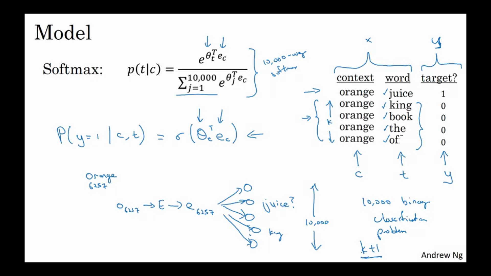

# Sequence Models:
* Used in:
 1. Speech Recognition
 2. Music Generation
 3. Sentiment Classification
 4. DNA sequence analysis
 5. Machine Translation
 6. Video activity recognition
 7. Name entity recognition

## Notation:
(Name Entity recogntion example):  

### Representing Words:
* Make a dictionary of like 10000 of the most commonly occuring words or look through online dictionary and take the 10000 most commonly occuring english words.
* Modern commercial applications use dictoinary size is around 50k.
* Represent each word as a **one hot** vector.
* For words not in the dictionary, create a UNK token in the dictionary. This will be seen later in this material.

## Recurrent Neural Networks (RNNs):

### Why not conventional neural networks:
1. Variable amount of input and output
2. Suppose the word "Harry" occurs as the first word of the sentence. Then the NN would learn to sort of treat the first word specially. But what if in the next sentence the name "Harry" comes in some other position.

### Points to understand from the above slide
**THESE SLIDES ARE FOR NAME ENTITY RECOGNITION**  
* The RNN learns from the prev as well as form the current (word or vector). 
* Since it only learns from the previous part, it may have diificulty in dealing with sentences in the lower half of the slide.
* The diagram on the right is another way people depict RNNs in papers etc.

* **All the parameters Waa, Wax, Wya are all the same. Think of this as different time steps of calculation.**

### Points to understand from the above slide
* Wax ---> Notation means that it is computed on an 'x' like quantity to calculate an 'a' type quantity. Same applies to the bias terms as well(notation).

* "a<0>" is taken as a vector of zeros or it is randomly initialized.

* **tanh is one of the most commonly used activation function here. Although ReLU may also be used.**

### Points to understand from the above slide
* This slide shows about the short notation of RNNs.
* Writing as Wa and as ["a&#60;t-1&#62;" , X(t)] has reduced the amount of calculation we have to write and has also vectorized the step.

### Backprop through time:

* **Re-iterating the fact that the parameters are the same. Hence it has been shown by arrows.**

* Loss function is again the same Cross-Entropy Loss function.
* The cost function is sum of all the losses.
* Since during the backpropagation algorithm we would have to update the weights of a previous time step, hence its name **backpropagation through time** which actually is an apt name for this.

### Different types of RNNs:

## Language Models:

### What is a language model:
* To identify that it is "tha apple and pear salad" and not "the apple and *pair* salad"

* The work of the language model is to predict what is the probability of a given sentence. It outputs the probability of the sequence of words.
* The words in the sentence are represented as y&#60;i&#62;

### How to build a language model:
* We require a large **corpus** of English text. Corpus is an NLP term which means a large body or large set.

* Suppose the sentence in the training example is "Cats average 15 hours of sleep a day."

 1. First TOKENIZE the sentence by building a vocabulary and converting each word to a one-hot vector.
 2. Another common thing to do is to add an &#60;EOS&#62; token for a full-stop.
 3. Then map these to y&#60;i&#62;. So here it would go on from y<1> to y<9> (including the EOS token). When we tokenize, we can decide whether EOS has to be a token or not.
 4. If sometimes the word doesn't occur in the dictionary we made, we may assign an "<UNK>" token to this word. For example, "The Egyptian <u>Mau</u> is a breed of cat."

### Modelling an RNN for building a language model:
* Running example:  
"Cats average 15 hours of sleep a day.<EOS>"

* The output from y is based on a softmax classifier, and hence there is a softmax loss function in the end.
* x&#60;t&#62; = y&#60;t-1&#62;
* **Notice the difference between yi and yi_hat**
* The output of the softmax is the probability given the previous words of the sentence.

### Sampling Novel Sequences:
* One way to see what the RNN has learnt is to sample novel sequences.
* Take a[0] and x<1> as 0 and find the probability of each word in the vocabulary.
* Now use `np.random.choice()` to get the first word. Now during sampling, pass the value of **y_hat<1> instead of y<1>** to the next time step.

* Continue this process and choose randomly using `np.random.choice()`.

* We can also have a "**character level RNN**". So the vocabulary is like [a,b,c...' ', ., ;, 0,1,3....,A,B,C....].
* Pros: We don't have to worry about the &#60;UNK&#62; token.
* Cons: It maybe too long and more computationally expensive. This may be the reason why word level language models work better than the character level models.

## Vanishing Gradients in RNNs:
* Since RNNs are long we may face the problem of vanishing and exploding gradients. 
* Exploding gradients are easy to take care of by just using **Gradient Clipping**. This means that if the gradient crosses a threshold then re-scale some of your gradient vectors so that is not too big.
* Vanishing gradients are much harder to handle. Due to this the network may not be able to use the information from layers in the beginning which may prove to be useful. (For very deep networks)

### Gated Recurrent Units (GRUs):
* Simplified Version of GRU:

* c&#60;t&#62; = a&#60;t&#62; here. But it's not the same always. In LSTMs it's different.

* c&#60;t&#62; is called memory cell. c_telda&#60;t&#62; is a potential replacement of c&#60;t&#62;.
* GAMMAu is called the Gate. Its value lies between 0 and 1 (obviously because if the sigmoid). The value which comes out of the gate determines whether there needs to be change in the memory cell or not.
* The value of the c&#60;t&#62; is given by the third equation.
* The pictorial summarization is given in the top-left side of the slide. Notice that these values of c&#60;t-1&#62; and GAMMAu determine the value of y_hat&#60;t&#62; and the value of c&#60;t&#62; which here is the value of a&#60;t&#62;.
* All the quantities marked in red boxes have the same dimension.

**Correction in the above slide:**  
there should be a  ' * ' sign instead of '+' in the 4th line.

* GAMMA_r is the metric that calculates the relevence of c&#60;t-1&#62; and c_telda&#60;t&#62;

* Researches have proven that it actually proves to be quite useful to have GAMMA_r term.

### Long Short Term Memory units (LSTMs):

* First point is to note that c&#60;t&#62; is not same as a&#60;t&#62; and hence in the gates also the equations are different than before.
* There are three gates in this unit, and hence the complexity is more than GRUs. 
* Instead of the 1-GAMMA_u in GRUs, We have the forget gate here. And also since c and a aren't the same there is an output gate to compute a from c.

* One main thing to be noted is the red line in the bottom figures which shows the memory and how the LSTM can use this memory in the future very easily. Also it also shows how easy it is for the network to learn to retain the memory or change it accordingly.

* LSTMs are usually preferred over GRUs, but are more computationally expensive.
* Theoretically, there is no hard and fast rule that LSTMs are better than GRUs or vice versa.
* **PEEPHOLE CONNECTION** is a variation of LSTMs, when the gates also include c&#60;t-1&#62; during its computation.

## Bi-Directional RNNs:

* Not to be used for speech recogntion since you'll have to wait for the person to finish the whole sentence and then only we can predict the whole sentence.
* BRNNs and LSTM can be combined and could make an effective model.

## Deep RNNs:

## Introduction to Word-Embeddings:
* One hot representation of words has a downside that it is very diffficult for the algorithm to identify that two words are actualluy related, like apple and orange. 
* One more reason for the algorithm to not be able to learn the relation is because the inner product of any two different words is 0.
* One of the weaknesses of this representation is that it treats each word as a thing unto itself. 
* As far as the learning algorithm knows the relationship between apple and orange is not any closer as the relationship between any of the other words man, woman, king, queen, and orange.
And so, it's not easy for the learning algorithm to generalize from knowing that orange juice is a popular thing, to recognizing that apple juice might also be a popular thing or a popular phrase. And this is because the inner product between any two different one-hot vectors is zero. 
* **Notation for one-hot** o_{position in vocab} , for example o_3473 represents the 3473rd word in the vocabulary.

* The high dimensional feature vector which we learn would not be easy to interpret.
* One way to represent these word embedding is to convert the 300D vector into the 2D plane using t-SNE [van der maaten and hinton 2008](https://www.google.com/url?sa=t&rct=j&q=&esrc=s&source=web&cd=&ved=2ahUKEwjln-qc1IXrAhXf6XMBHQkGDpcQFjABegQIBRAB&url=http%3A%2F%2Fwww.jmlr.org%2Fpapers%2Fvolume9%2Fvandermaaten08a%2Fvandermaaten08a.pdf&usg=AOvVaw11Jgz7vuRT-PbbxSHmn6F_)

### Properties of Word Embeddings:
* It can detect analogies like man:woman :: king:?
* For doing this subtract the word embedding vector of woman from man and all the other words from king,. Check which one is most **similar** to the difference b/w man and woman. Ideally this should lead to the word "Queen".

## Learning Word Embeddings:
* Complex algoriithms were proposed initially, but now really simpler algorithms can perform as well as the old ones.

* By learning content to target pairs we can learn the Matrix E whuch will store the embedding values for each word in the dictionary.

[Bengio et al, 2003](https://www.google.com/url?sa=t&rct=j&q=&esrc=s&source=web&cd=&ved=2ahUKEwiom6zq-4XrAhU-8HMBHV3MDZcQFjABegQIARAB&url=http%3A%2F%2Fwww.jmlr.org%2Fpapers%2Fvolume3%2Fbengio03a%2Fbengio03a.pdf&usg=AOvVaw00AdtIWw9CJXd9m76XaIQh)

### Word2Vec:
* Given a context word, we want to predict the target word which lies say within a range of 10 words on either side of the context word.

* We want to learn the mapping of context to target.

* Problem with this model is that softmax is computationally heavy with increasing vocab sizes.

* One way is to use hierachical softmax.
	- In practice this tree may not be symmetric.

* How to sample the context words:
	- Uniform
	- Some other heuristics are used. (refer the paper)

[Mikolov et al 2013](https://arxiv.org/pdf/1301.3781)

### Negative Sampling:
* Method devised to overcome the coputationally heavy softmax unit.
[Mikolov, 2013 et al](https://www.google.com/url?sa=t&rct=j&q=&esrc=s&source=web&cd=&ved=2ahUKEwjq3ODa8orrAhVB63MBHUOgBQcQFjABegQIBRAB&url=https%3A%2F%2Fpapers.nips.cc%2Fpaper%2F5021-distributed-representations-of-words-and-phrases-and-their-compositionality.pdf&usg=AOvVaw3lEm7W86bi2fXnfFRBIz1j)

* Take a context word and then get a target word which is in the range (say 10 words).
* Now sample "k", negative examples by picking out random words from the vocabulary, even though 1-2 words might lie in the range consider all these as negative examples. 
* This is used to distinguish the distribution.
* k = 5-20 smaller datatsets and 2-5 for larger datasets.

* <b>Model</b>

- Logistic Regression model. 
- Instead of having a 10000 dim softmax, we have to only use a logisitc loss for the k -ve and the 1 positive example.
- How to sample the -ve examples:
	- Authors reported that f(wi)^(3/4)/(sum(f(wi)^(3/4)))
	where f(wi) is the frequency of the occurance of the word.
* Open source implementations are available so try to use tham.

### GloVe Model (Globalised Vectors for Word Representation)

* [pennington et al. 2014](https://www.aclweb.org/anthology/D14-1162.pdf) 

## Sentiment classification problem:

* Even if we have a small dataset, we can still have a good learning algorithm if we have a word embedding.

### Simple sentiment classification model:
* Convert the words from one hot labels to word embeddings.
* Now **average** all the word embeddings.
* Feed it to the softmax classifier.
* Algorithm works decently well. 
* <b>Problems with this model is that it ignores the ordering of the review. For example if the review says that the food was not *good* and it can capture all the *goods* from the review and increase the rating.</b>

* Even if some words are not present in the vocab and appear in the reviews, we may expect our RNN to overcome these words.

[bolukbasi et al. 2016](https://www.google.com/url?sa=t&rct=j&q=&esrc=s&source=web&cd=&ved=2ahUKEwiulZPp54vrAhV26XMBHYkXCJwQFjABegQIBRAB&url=https%3A%2F%2Fpapers.nips.cc%2Fpaper%2F6228-man-is-to-computer-programmer-as-woman-is-to-homemaker-debiasing-word-embeddings.pdf&usg=AOvVaw1Qz9r959XanW5mJF50-ccm)
